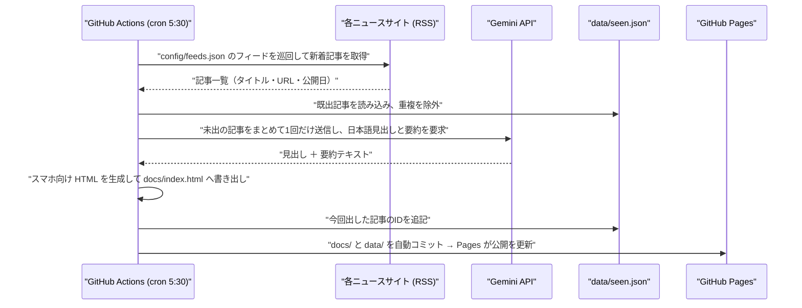

# 925-Mirai-Shinbun（未来新聞）

## プロジェクト概要

複数サイトの RSS フィードから最新ニュースを毎朝自動収集し、Gemini API が日本語の見出しと要約を生成、スマホ向けの HTML ページとして GitHub Pages に自動公開する**汎用ニュースまとめアプリ**です。

収集対象のジャンルは `config/` の設定ファイルで差し替えられるため、AI・技術ニュースに限らず任意のジャンルへ転用できます（初期設定は **AI・技術ニュース**）。

> [!IMPORTANT]
> 本アプリはリポジトリ内で唯一の **GAS を使わない（GitHub Actions ベース）** アプリです。
> `clasp push` / Agent-G デプロイ / Ver 定数の二重更新は**対象外**です。デプロイは `git push` のみで完結します。

---

## システム構成 (依存関係)

| サービス種別 | 連携システム名 | 開発/設定URL(コード等) | 本番/公開URL(WebApp等) | データ保存先 | 役割・用途 |
| :--- | :--- | :--- | :--- | :--- | :--- |
| **GitHub Actions** | 定期実行エンジン | `.github/workflows/daily.yml` | - | - | 毎朝 5:30 (JST) にクラウド上で収集〜公開までを実行するタイマー兼サーバー |
| **GitHub Pages** | 公開ページ配信 | `docs/` | （未設定） | `docs/index.html` | 生成済み HTML の静的配信。スマホのホーム画面に追加して閲覧する |
| **Gemini API** | 要約エンジン | - | - | - | 収集記事をまとめて 1 日 1 回だけ呼び出し、日本語の見出しと要約を生成 |
| **RSS 各サイト** | ニュース供給元 | `config/feeds.json` | - | - | 収集対象フィードの一覧。ジャンル変更はこのファイルのみで行う |

> [!NOTE]
> `GEMINI_API_KEY` は **GitHub リポジトリの Secrets** に保管します（GAS でいうスクリプトプロパティに相当）。
> コードへの直書きは Agent-T / Secrets-Management 規約により禁止です。

---

## フォルダ構成

```
925-Mirai-Shinbun/
├─ .github/workflows/   定期実行の設定（cron ＝ GAS の時間主導型トリガー相当）
├─ config/              収集対象フィード・ジャンル設定
├─ scripts/             収集 / 要約 / HTML生成の処理本体
├─ data/                「既に出した記事」の記録（重複除け用・唯一の永続データ）
└─ docs/                生成された公開ページ（GitHub Pages の配信元）
```

---

## データの流れ (Data Flow)



---

## データの置き場について

**データベースは使いません。** 毎朝ページを丸ごと作り直すため、永続化が必要なのは「どの記事を既に出したか」だけです。

| 置くもの | 場所 | 更新方法 |
| :--- | :--- | :--- |
| 生成した HTML | `docs/index.html` | Actions が毎朝上書きコミット |
| 既出記事の記録 | `data/seen.json` | 同上（重複除け専用） |
| API キー | GitHub Secrets | 初回に手動登録 |
| 収集設定 | `config/feeds.json` | 手動編集 |

---

## 公開範囲に関する注意

GitHub Pages を無料プランで使う場合、公開ページは**誰でも閲覧可能**になります。
本アプリは外部公開ニュースのみを扱うため問題ありませんが、**社内データを扱う用途へ転用する際は公開範囲を必ず再検討**してください。

---

## 開発状況

| Step | 内容 | 状態 |
| :--- | :--- | :--- |
| 1 | cron で起動 → HTML を生成 → Pages で公開（パイプライン疎通） | 完了（2026-09-20 実機検証済み） |
| 2 | RSS から記事を取得して一覧化 | 完了 |
| 3 | Gemini による日本語要約を追加 | 実装済み（Actions で検証予定） |
| 4 | 既出記事の持ち越し除外（`data/seen.json`） | 未着手 |

---

## デプロイ・バージョン管理

### デプロイ方法

```bash
git push
```

push した時点で Actions と Pages に反映されます。GAS のような deploy コマンドは不要です。

### バージョン管理

- Git のコミット履歴がそのままバージョン履歴になります。
- Agent-T の Version-Deploy-Policy（PATCH 必須 +1・Ver 定数の二重更新）は **GAS 向け規約のため本アプリでは適用外**です。
- 画面へのバージョン表示は、生成 HTML のフッターに最終更新日時を出すことで代替します。
